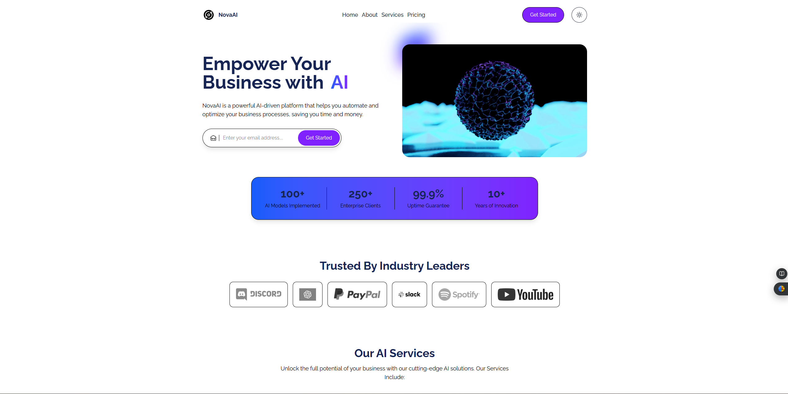
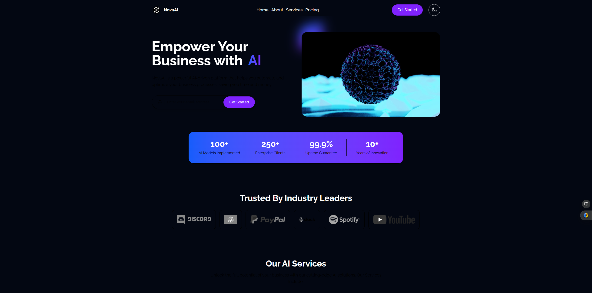

# NovaAI Landing Page 🚀

A modern, responsive landing page for AI products and services built with React and TypeScript.




## 🌟 Features

- **Fully Responsive Design**: Looks great on all devices from mobile to desktop
- **TypeScript Integration**: Type-safe code for better development experience
- **Modern React Patterns**: Built with functional components and hooks
- **Optimized Dark Mode & Light Mode**: Fast loading and smooth animations
- **Customizable Sections**: Easy to modify content and layout

## 🛠️ Tech Stack

- React 18+
- TypeScript 5+
- Tailwind CSS for styling
- React Testing Library for tests
- Vite for build tooling

## 📋 Prerequisites

- Node.js (v16+)
- npm or yarn or pnpm

## 📁 Project Structure

```
ai-landing-page/
├── public/             # Static files
├── src/
│   ├── assets/         # Images, fonts, etc.
│   ├── component/     # Reusable components
│   │   ├── cards/     # Common UI components
│   │   ├── Elements/     # Layout components
│   │   └── sections/   # Page sections
│   ├── hooks/          # Custom React hooks
│   ├── pages/          # Page components
│   ├── styles/         # Global styles
│   ├── types/          # TypeScript type definitions
│   ├── utils/          # Utility functions
│   ├── App.tsx         # Main App component
│   ├── main.tsx        # Entry point
│   └── vite-env.d.ts   # Vite type declarations
├── .eslintrc.cjs       # ESLint configuration
├── .gitignore          # Git ignore file
├── index.html          # HTML template
├── package.json        # Dependencies and scripts
├── README.md           # Project documentation
├── tailwind.config.js  # Tailwind CSS configuration
├── tsconfig.json       # TypeScript configuration
└── vite.config.ts      # Vite configuration
```

### Deployment Options

- **Vercel**: Connect your GitHub repository for automatic deployments
- **Netlify**: Connect your GitHub repository or manually upload the `dist` folder
- **GitHub Pages**: Deploy using GitHub Actions workflow
- **AWS Amplify**: Connect your repository for CI/CD pipeline

## 🙏 Acknowledgements

- [React](https://reactjs.org/)
- [TypeScript](https://www.typescriptlang.org/)
- [Tailwind CSS](https://tailwindcss.com/)
- [Vite](https://vitejs.dev/)
- [PedroTech](https://www.youtube.com/@PedroTechnologies/)

## 📞 Contact

Kasam Ali Aftab

Project Link: [https://github.com/VERIDIITE/NovaAI-Landing-Page](https://github.com/VERIDIITE/NovaAI-Landing-Page)

---

Made with ❤️ by KASAM
